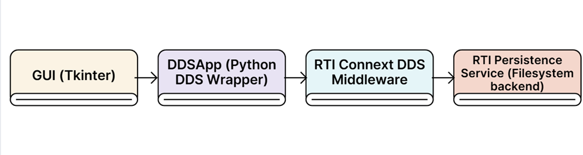

# 🗨️ DDS Chat Application

A simple yet powerful **chat application** built with **RTI Connext DDS** and **Tkinter**.  
It supports **real-time messaging**, **user presence tracking**, and **persistent message history**, all powered by DDS topics and QoS configurations.

---

## 🚀 Overview

This project demonstrates how to build a **distributed chat system** using **Data Distribution Service (DDS)**.  
Each chat client acts as a DDS participant that can publish and subscribe to user and message topics.

When one user sends a message, it’s automatically delivered to other participants subscribed to that topic; no central server required.

Persistence is enabled so messages remain available even if no one is connected at the time of publishing.

---

## ✨ Features

- **User Presence Tracking**  
  See users join or leave dynamically across participants.

- **Group & Private Messaging**  
  Send messages to a specific user or broadcast to your group.

- **Persistent History**  
  Stored messages survive participant restarts (via RTI Persistence Service).

- **Search Chat History**  
  Search messages by content, sender, or destination.

- **GUI Frontend (Tkinter)**  
  Simple interface for joining, chatting, and browsing users.

- **QoS Profiles**  
  Configurable via XML (`chat_qos.xml`) for reliability, persistence, and history depth.

---

## 🧩 Architecture



---

## 📁 Project Structure

```
├── chat.idl                       # Data definitions for
├── chat.py                        # Auto-generated from
├── chat_qos.xml                   # QoS profiles for
├── dds_app.py                     # DDS backend logic
├── gui.py                         # Tkinter GUI
├── main.py                        # Entry point: wires
└── persistence/
    ├── persistence_service.xml    # RTI Persistence
    └── data/                      # Storage directory
```

---

## 🧰 Prerequisites & Installation

1. Install **RTI Connext DDS** (with the **Persistence Service** component).
2. Ensure the Python API is available:
   ```bash
   pip install rti.connextdds
   ```
3. Make sure the persistence folder exists:
   ```bash
   mkdir -p persistence/data
   ```

---

## ▶️ Running the Chat

### 1) Start the RTI Persistence Service (separate terminal)

**Windows (PowerShell):**

```bat
"C:\Program Files\rti_connext_dds-7.x.x\bin\rtipersistenceservice.bat" ^
  -cfgFile "%CD%\persistence\persistence_service.xml" ^
  -cfgName ChatPS
```

### 2) Run the Python app (on diffrent PowerShell)

```bash
python main.py
```

Each instance opens a new chat window.  
Run two or more instances to simulate different users.

---

## Usage

1. **Enter your username and group**, then click **Join**.
2. Type messages and click **Send**.
3. Click **Search** to look up messages in history.
4. Click **Update** to change your group.
5. Click **Leave** to disconnect safely.

---

## How Persistence Works

- The **RTI Persistence Service** runs separately, reading `persistence/persistence_service.xml`.
- The Python app uses `chat_qos.xml` for QoS (with `RELIABLE`, `KEEP_ALL`, `PERSISTENT` settings).
- All messages are stored in `persistence/data/`, then replayed to new or restarted participants.

### To confirm it works

1. Start the Persistence Service.
2. Run two chat windows, send messages.
3. leave a chat windows.
4. rejoin the chat — previous messages will automatically reappear.

---
